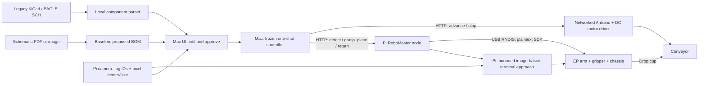

# Hardware Context Protocol (HCP)

Read a schematic with Baseten, let a human correct and approve its BOM, then coordinate two independent HTTP nodes: a DJI RoboMaster EP delivers a labeled cup to a conveyor, and the Mac commands the belt to advance.

**Current status:** the backend and simulated two-node flow include **image-based terminal approach** inside the Pi executor. The one-shot plan is unchanged. Real EP motion/video have not been tested. Arduino board/driver selection and firmware are deferred. Hardware is disabled by the untaught/unverified configuration defaults.

Start with the [complete architecture and hardware handoff](docs/ARCHITECTURE.md): repository map, exact robot behavior, safety boundaries, missing inputs, and staged bring-up.

## Architecture



The LLM supplies the proposed part requirements. After approval, a deterministic controller dispatches the fixed sequence; there is no second planning loop, autonomous recovery, or automatic command retry.

For each confirmed **type**, regardless of its quantity:

```text
detect → coarse approach → visual alignment → scripted grip → retrace approach
       → drive to belt → drop/clear arm → belt advance → return → observe
```

One cup represents one part type. A BOM quantity of 3 does not trigger three cup pickups.
Detection counts tagged cups, **not individual components inside a cup**. Missing cups are reported and skipped; command, transport, camera or schema errors halt the run and request both nodes to stop.

### Important contract corrections

- `POST /grasp_place` ends after drop and arm clearance. The Mac calls the conveyor, waits for completion, then calls `POST /return`. A single blocking Pi call cannot insert an independent Mac belt command in its middle.
- `GET /detect` never moves anything. Preview before approval would violate the gate if it automatically called `observe()`. Position the robot at observe locally before starting; subsequent returns restore that commanded pose.
- The Pi resolves the requested type to a tag ID and uses fresh tag pixel centers/apparent sizes for bounded strafe/forward corrections. This is a local feedback controller, **not LLM replanning**. No camera intrinsics, camera-to-gripper extrinsic matrix, metric tag localization or physical-tag-size distance formula is used.
- Teach the target image center and apparent size at an actually graspable configuration. Image center alone does not establish gripper alignment. Tag mounting, printed size, camera orientation and cup/grasp geometry must remain consistent.
- Horizontal center and apparent size drive chassis corrections. Vertical pixel error is a success gate, not an independently controllable axis on a planar chassis. Lost/ambiguous tags, stale frames, unresolved vertical error or exceeded limits halt without gripping.
- Calibration files use arm **millimeters**, but DJI's **plaintext** arm commands use **centimeters**. The socket boundary divides by 10. Chassis commands use meters and degrees. The Python SDK uses a different arm unit convention. [DJI plaintext reference](https://robomaster-dev.readthedocs.io/zh-cn/latest/text_sdk/protocol_api.html#id70)
- An `ok` reply plus an open-loop dwell is not independent proof of grip, arrival, or delivery. Every run reports `physical_delivery_verified: false`.

## Source map

| File/module | Responsibility |
| --- | --- |
| `ingestion/parse.py`, `sch.py`, `bom_schema.json` | PDF/image rendering, local SCH parsing, flat BOM validation |
| `orchestrator/baseten_client.py`, `ingest.py` | One real structured-output call; credentials from environment |
| `orchestrator/schematic_advice.py` | Advisory rules on parsed component data; never edits the BOM or dispatches motion |
| `ui/app.py`, `ui/static/` | Multi-format upload, requested-parts cards, editable BOM + detection preview, approval, progress and stop |
| `orchestrator/controller.py`, `nodes.py` | One-shot sequential execution; common no-retry HTTP client |
| `actuator/motion.py` | EP plaintext command serialization, unit conversion, dwell and quit |
| `actuator/perception.py` | Fresh video frame → tag36h11 IDs/counts + pixel corners/center/size |
| `actuator/approach.py` | Coarse route + bounded image servo + scripted grip + successful-path retrace |
| `actuator/server.py`, `main.py` | Pi HTTP state machine, run authorization, no overlapping motion/detection |
| `actuator/conveyor_node.py` | **HTTP simulator only**, including interruptible timed advance |
| `tag_map.yaml`, `poses.yaml`, `config.yaml` | Part identities, placeholder calibration, node URLs |
| `firmware/README.md` | Hardware-dependent Arduino work deferred until board/driver confirmation |

The old custom arm is **removed**, not an alternative execution mode: SG90/PCA9685 drivers,
SO-100 config, palette planner/executor/calibrator, IK, serial arm/conveyor drivers, servo
firmware, world-pose camera runtime, and old orchestration/demo backends.

The reference `hcp_sdk` generator/schema/runtime and `hcp_host` NDJSON infrastructure remain
as an independently tested compatibility library. They do **not** run in this HTTP architecture;
obsolete deployment node definitions and the loader were removed. Do not start TCP port 9000
or generated clients for this version. Historical project notes/screenshots are not setup instructions.

## Run without hardware

Python 3.10+:

```bash
python3 -m venv .venv
source .venv/bin/activate
pip install -r requirements.txt
python -m main run --bom sample_bom.json --dry-run
```

This offline smoke test prints the ordered plan and plaintext commands, then executes both HTTP
contracts in-process. It uses explicit simulation, not a fake ingestion result. It performs no
network, camera, motor, or Baseten access. The sample resolves three types and simulates three
cup deliveries. An unknown type fails before any motion command.

### Full browser flow with real ingestion and simulated actuators

In separate terminals, with the venv active:

```bash
python -m actuator.main --dry-run --port 8081
python -m actuator.conveyor_node --port 8082
```

Copy `config.yaml` to the ignored `config.local.yaml`. For this local test, set:

```yaml
pi: {base_url: "http://127.0.0.1:8081"}
arduino: {base_url: "http://127.0.0.1:8082", advance_seconds: 3}
baseten:
  url: "https://inference.baseten.co/v1"
  model: null
  api_key_env: BASETEN_API_KEY
tag_map: tag_map.yaml
node_token_env: HCP_NODE_TOKEN
```

In the **Mac backend terminal**, configure your key/model, then start:

```bash
export BASETEN_API_KEY="<your current key>"
export BASETEN_VISION_MODEL="<confirmed vision model slug>"
python -m ui.app --config config.local.yaml --web-port 5002
```

Open [localhost:5002](http://localhost:5002). Upload a PDF, JPEG, PNG, BMP, TIFF, or legacy
KiCad/EAGLE XML `.sch` file. Inspect the proposed BOM beside the simulated tag rollup,
edit it, check the confirmation box, and approve. The light-themed frontend displays
requested quantities, node health, advisory checks, the ordered plan and live progress.
Its animated 3D circuit-board background is decorative only: Three.js is bundled locally,
no CDN is required, and reduced-motion/no-WebGL environments have a static/plain fallback.
Uploading and previewing never move either actuator. The UI does not fabricate a BOM if
Baseten fails. A malformed response, 429, refusal or timeout is surfaced without auto-retry.

PDF/images use one Baseten call. `.sch` files are parsed locally and do not need a model
or API key; neither does the explicit manual-BOM input. The SCH parser preserves original
type/value/refdes records for review and maps exact `type:value` cup labels, or complete
sets of known reference labels, to the flat BOM. Unknown labels stay visible and block
approval until the human maps them to configured cups. Modern `.kicad_sch` and hierarchical
SCH designs are not supported.

Schematic suggestions are **rule-based advisory checks**, not a second LLM call or an
electrical-safety review. Values from SCH records support richer checks; flat cup labels
without values support only limited advice. Suggestions never change the BOM or move hardware.

`.env` is ignored but **not automatically loaded**. Do not put credentials in committed YAML.
No tool-calling or audio model is required in this version. API capability/rate limits depend
on the confirmed live vision deployment; they are not guaranteed by the code.

## Pi deployment and real EP bring-up

The default `poses.yaml` has `calibrated: false` and `visual_approach.taught: false` and cannot enable hardware. Both require supervised hardware verification; no metric camera calibration is needed.

1. Clone this repo onto the Pi; use Python 3.10+ and `pip install -r requirements-pi.txt`.
2. Connect the Pi to EP over USB/RNDIS. Pi Wi-Fi reaches the Mac/Arduino LAN; Mac needs
   internet for Baseten. The EP Wi-Fi mode does not determine its USB address.
3. Confirm the USB interface and actual endpoint. DJI documents `192.168.42.2` as its
   default USB address, but this program requires an explicit `--ep-host`. Do not substitute
   the Pi Wi-Fi IP. [DJI connection reference](https://robomaster-dev-en.readthedocs.io/en/latest/text_sdk/connection.html)
4. Configure a shared random `HCP_NODE_TOKEN` of at least 24 characters on Mac and Pi.
   Use only a trusted isolated LAN: HTTP bearer tokens are not encrypted. Do not expose
   these services to the internet.
5. Copy to ignored `poses.local.yaml`; verify the scripted arm/belt poses and coarse routes.
   Teach the image setpoint and check both correction directions at low speed. Set
   `calibrated: true` and `visual_approach.taught: true` only after these checks.
6. Physically establish the same startup arm origin/chassis observe station. Clear the
   path, support the cup, and keep a physical stop available. Start the Pi node:

```bash
python -m actuator.main --poses poses.local.yaml --tags tag_map.yaml \
  --ep-host <CONFIRMED_RNDIS_IP> --at-observe --bind 0.0.0.0 --port 8081
```

This enables communication/camera, not a startup arm movement. Point the Mac's `pi.base_url`
at the Pi's **Wi-Fi** address. Use the real conveyor URL only after firmware/wiring verification.
Do a single cup with an empty/clear path before multiple cycles.

The camera implementation uses `stream on;` over the same plaintext control connection and
decodes the EP's H.264 TCP stream on port 40921 with PyAV. This avoids competing Python-SDK
and plaintext sessions and the old DJI package's Python-version constraints. Its
`start_video_stream(display=False)`/`read_cv2_image(strategy="newest")` adapter is intentionally
small; hardware stream compatibility still needs verification. [DJI stream format](https://robomaster-dev.readthedocs.io/en/latest/text_sdk/protocol_struct.html#the-video-stream)

### Teaching and configuration checklist (no metric camera calibration)

- `observe_pose`: arm out of camera view and safe to carry a closed-gripper cup.
- `grab_pose`: one scripted arm target after the chassis has visually aligned the requested tag.
- `coarse_routes.<tag_id>`: short odometry-only translation legs from observe; an empty list
  explicitly means the tag is already near enough. Heading stays fixed (`z_deg: 0`).
- `visual_approach`: taught image center and mean tag side length in pixels at 640×360;
  check lateral/forward signs and bounds. Default coordinates/sizes are simulation placeholders.
  All cup tags must use consistent printed size/mounting and grasp geometry.
- Read image features without arming motion using
  `python -m actuator.main --inspect-camera --ep-host <CONFIRMED_RNDIS_IP>`.
  This diagnostic prints fresh detections; it cannot expose motion endpoints or send arm/chassis commands.
- `drop_pose`: cup clears belt hardware; subsequent observe retracts before belt advance.
- `conveyor_wp`/`home_wp`: **relative** chassis legs in meters/degrees, not global coordinates.
  Calibrate the return separately; simply negating a rotated outbound leg is not generally correct.
- Calibrate gripper force and arm/gripper/chassis dwell times. Test command-response timing.
- Keep paths short, cups/belt fixed, floor consistent. Returning by dead reckoning does **not**
  eliminate drift or measure a home position.
- After gripping, the executor retraces successful coarse/visual translation commands in reverse
  so the existing conveyor leg begins at the commanded observe station. Verify carry clearance;
  that retrace and belt/drop remain open-loop. No retreat is attempted on an error.
- Supply separate motor power to the conveyor driver, with the appropriate common ground;
  never power its motor from Arduino pins. Board/driver/pins are still **CONFIRM**.

No unsupervised jog/capture wizard is included. Never copy zero-valued templates into hardware
and assume they are safe. No hardware calibration was performed in this environment.

Visual corrections default to 1 cm steps at 0.05 m/s, 3 consecutive aligned frames, at most
40 corrections / 0.30 m cumulative terminal travel / 45 seconds. These are configurable
software caps, not experimentally established safe values for your setup. Severe skew,
clipped/tiny/oversized tags, wrong resolution and a non-improving error also abort.

## Stops and failures

- The Mac never retries a motion or belt command after a timeout; execution may already have occurred.
- A step error requests Pi `/estop` and belt `/stop` concurrently and halts the plan.
- Pi stop sends `quit;`, disconnects, and latches the session. It does not make an unverified
  recovery drive/home move. Restart locally after inspection; approval cannot clear a stop.
- Ctrl-C/SIGTERM on the Mac requests both stops; Pi shutdown sends quit.
- Stop delivery over a broken link is best effort. Abrupt process death/power loss cannot be
  handled by these HTTP requests. Keep physical stops accessible and a supervisor present.
- The future belt firmware must use a local duration deadline and still service `/stop`
  during advance. A blocking `delay()` that ignores stop is not acceptable.
- The system does not sense cup contents, grip success, belt occupancy, or actual delivery.

## JSON and HTTP

See [docs/protocol.md](docs/protocol.md) for the complete endpoint sequence.

```json
{"R3": 2, "C1": 1, "LED_RX": 3}
```

BOM keys are exact cup/type labels. Quantities must be positive JSON integers.
Do not send the retired `components` array or palette joint-angle JSON to this API.

## Verification

```bash
python -m pytest -q
```

Tests cover approval/no-motion preview, edited BOMs, duplicate approval, single-call ingestion,
synthetic AprilTag pixel features, visual convergence and budgets, stale/lost/duplicate tags,
socket split replies and unit conversion, sequential drop/belt/return, missing cups,
no command retries, urgent stops, and real localhost HTTP between simulated nodes.
Reference codegen/NDJSON regression tests remain. No test claims physical delivery or makes
a paid Baseten call.

## Reference provenance

Original reference: [danielzyy/calhacks2025](https://github.com/danielzyy/calhacks2025/tree/f7cf00663244377b9c79270f0175756904819534),
pinned at `f7cf00663244377b9c79270f0175756904819534`.
The unchanged node schema and generator/transport adaptations remain in the compatibility
library. The live RoboMaster/conveyor architecture now uses HTTP instead of its discovery path.

The previous [simulation screenshot](docs/images/schematic-to-fetch-simulation.png) is retained
as historical project material, not a depiction of current hardware.
