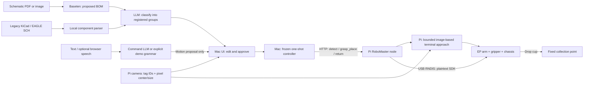

# Schematic to Fetch

Read a schematic with Baseten, review its parts and LLM suggestions, then approve a DJI RoboMaster EP to deliver labeled cups to a fixed collection point.

**Current status:** the backend and simulated RoboMaster flow include **image-based terminal approach** inside the Pi executor. Real EP motion/video have not been tested. Hardware is disabled by the untaught/unverified configuration defaults.

Start with the [complete architecture and hardware handoff](docs/ARCHITECTURE.md): repository map, exact robot behavior, safety boundaries, missing inputs, and staged bring-up.

## Architecture



The vision LLM supplies the proposed part requirements and a separate advisory review of
PDF/image schematics, including possible faults and estimated damage costs. An optional command LLM interprets
text or speech transcripts into a single validated action proposal. Neither can approve
motion. After click approval, a deterministic controller dispatches the fixed sequence;
there is no mid-run planning loop, autonomous recovery, or automatic command retry.

For each confirmed **type**, regardless of its quantity:

```text
detect → coarse approach → visual alignment → scripted grip → retrace approach
       → drive to collection point → drop/clear arm → return → observe
```

One cup represents one registered group. A BOM quantity of 3 does not trigger three cup pickups.
Detection counts tagged cups, **not individual components inside a cup**. Missing cups are reported and skipped; command, transport, camera or schema errors halt the run and request RoboMaster to stop.

### Registered component groups

All tags use the `tag36h11` family. The definitions in `tag_map.yaml` are shared by the
classifier and the robot; IDs 3 and 4 are not assigned.

| AprilTag ID | Group | Typical contents |
| --- | --- | --- |
| 0 | resistors | Fixed resistors, potentiometers, thermistors, resistor networks |
| 2 | capacitors | Ceramic, electrolytic, film and other capacitors |
| 6 | integrated circuits | Individual logic, amplifier, timer, regulator and driver ICs |
| 7 | motors | DC, brushless, stepper and servo motors; motorized fans |
| 1 | inductors | Inductors, chokes, ferrite beads, transformer windings |
| 5 | custom printed circuit boards | Bare/assembled PCBs, breakout boards, board-level modules |
| 8 | diodes/LED | Rectifiers, signal/Zener/TVS diodes, photodiodes and LEDs |

Every extracted entry receives exactly one group. Specific component identities take priority;
a motor driver chip is an IC, while a complete driver board is a PCB. For components outside
these definitions, the LLM chooses the closest of the seven and flags the forced match with
low confidence and an explanation. Medium-confidence matches are also highlighted for review.
This is a storage assignment, not a claim of electrical equivalence.

The UI preserves the original extraction and displays its component-to-group-to-tag mapping.
Backend proposals also include `tagged_bom`, keyed by group name with `quantity` and the full `tag_id` (such as `tag36h11[0]`)
inside each entry; the frontend's BOM output shows this format. Approval still accepts the
flat group-to-quantity BOM.
Quantities are summed locally from the original BOM; the model cannot change counts or tag IDs.
Missing/duplicate assignments and invented groups are rejected. A failed classification keeps
the raw BOM available for manual correction. Editing the grouped BOM marks the original
classification and schematic review as stale.

### Important contract corrections

- `POST /grasp_place` ends after drop and arm clearance at the collection point. The Mac validates the full drop log, then calls `POST /return` immediately.
- `GET /detect` never moves anything. Preview before approval would violate the gate if it automatically called `observe()`. Position the robot at observe locally before starting; subsequent returns restore that commanded pose.
- The Pi resolves the requested type to a tag ID and uses fresh tag pixel centers/apparent sizes for bounded strafe/forward corrections. This is a local feedback controller, **not LLM replanning**. No camera intrinsics, camera-to-gripper extrinsic matrix, metric tag localization or physical-tag-size distance formula is used.
- Teach the target image center and apparent size at an actually graspable configuration. Image center alone does not establish gripper alignment. Tag mounting, printed size, camera orientation and cup/grasp geometry must remain consistent.
- Horizontal center and apparent size drive chassis corrections. Vertical pixel error is a success gate, not an independently controllable axis on a planar chassis. Lost/ambiguous tags, stale frames, unresolved vertical error or exceeded limits halt without gripping.
- Calibration files use arm **millimeters**, but DJI's **plaintext** arm commands use **centimeters**. The socket boundary divides by 10. Chassis commands use meters and degrees. The Python SDK uses a different arm unit convention. [DJI plaintext reference](https://robomaster-dev.readthedocs.io/zh-cn/latest/text_sdk/protocol_api.html#id70)
- An `ok` reply plus an open-loop dwell is not independent proof of grip, arrival, or delivery. Every run reports `physical_delivery_verified: false`.

## Source map

| File/module | Responsibility |
| --- | --- |
| `ingestion/parse.py`, `sch.py`, `bom_schema.json` | PDF/image rendering, local SCH parsing, flat BOM validation |
| `orchestrator/baseten_client.py`, `ingest.py` | Structured BOM extraction and optional vision review; credentials from environment |
| `ingestion/review.py` | Strict advisory findings and estimated parts-replacement cost contract |
| `ingestion/classification.py` | Complete source-to-group validation and local quantity aggregation |
| `orchestrator/commands.py`, `ui/static/commands.js` | Optional text/push-to-talk input, typed language intents, explicit demo grammar |
| `orchestrator/schematic_advice.py` | Advisory rules on parsed component data; never edits the BOM or dispatches motion |
| `ui/app.py`, `ui/static/` | Multi-format upload, requested-parts cards, editable BOM + detection preview, approval, progress and stop |
| `orchestrator/controller.py`, `nodes.py` | One-shot sequential execution; common no-retry HTTP client |
| `actuator/motion.py` | EP plaintext command serialization, unit conversion, dwell and quit |
| `actuator/perception.py` | Fresh video frame → tag36h11 IDs/counts + pixel corners/center/size |
| `actuator/approach.py` | Coarse route + bounded image servo + scripted grip + successful-path retrace |
| `actuator/server.py`, `main.py` | Pi HTTP state machine, run authorization, no overlapping motion/detection |
| `tag_map.yaml`, `poses.yaml`, `config.yaml` | Part identities, placeholder calibration, node URLs |

The old custom arm is **removed**, not an alternative execution mode: SG90/PCA9685 drivers,
SO-100 config, palette planner/executor/calibrator, IK, legacy serial drivers,
world-pose camera runtime, and old orchestration/demo backends.

The reference `hcp_sdk` generator/schema/runtime and `hcp_host` NDJSON infrastructure remain
as an independently tested compatibility library. They do **not** run in this HTTP architecture;
obsolete deployment node definitions and the loader were removed. Do not start TCP port 9000
or generated clients for this version. Historical project notes/screenshots are not setup instructions.

## Run without hardware

Python 3.10+:

```bash
python3 -m venv .venv
source .venv/bin/activate
pip install -r requirements.txt
python -m main run --bom sample_bom.json --dry-run
```

This offline smoke test prints the ordered plan and plaintext commands, then executes the RoboMaster HTTP
contract in-process. It uses explicit simulation, not a fake ingestion result. It performs no
network, camera, motor, or Baseten access. The sample resolves three types and simulates three
cup deliveries. An unknown type fails before any motion command.

### Full browser flow with real ingestion and a simulated robot

In separate terminals, with the venv active:

```bash
python -m actuator.main --dry-run --port 8081
```

Copy `config.yaml` to the ignored `config.local.yaml`. For this local test, set:

```yaml
pi: {base_url: "http://127.0.0.1:8081"}
baseten:
  url: "https://inference.baseten.co/v1"
  model: null
  api_key_env: BASETEN_API_KEY
tag_map: tag_map.yaml
node_token_env: HCP_NODE_TOKEN
```

In the **Mac backend terminal**, configure your key/model, then start:

```bash
export BASETEN_API_KEY="<your current key>"
export BASETEN_VISION_MODEL="<confirmed vision model slug>"
python -m ui.app --config config.local.yaml --web-port 5002
```

Open [localhost:5002](http://localhost:5002). Upload a PDF, JPEG, PNG, BMP, TIFF, or legacy
KiCad/EAGLE XML `.sch` file. Inspect the proposed BOM beside the simulated tag rollup,
edit it, check the confirmation box, and approve. The light-themed frontend displays
requested quantities, node health, advisory checks, the ordered plan and live progress.
Its animated 3D circuit-board background is decorative only: Three.js is bundled locally,
no CDN is required, and reduced-motion/no-WebGL environments have a static/plain fallback.
Uploading and previewing never move the robot. The UI does not fabricate a BOM if
Baseten fails. A malformed response, 429, refusal or timeout is surfaced without auto-retry.

Browser PDF/image uploads use a Baseten call to extract the original component BOM, a
separate vision review of the same rendered pages, then a classification call over the
extracted labels. Classification uses the configured vision model with text input.
Legacy `.sch` extraction runs locally and preserves type/value/refdes records; these records
then go to the model for grouping. Pasted raw component JSON also uses model classification.
Manual JSON already using the exact registered group names works without a model or API key.
Modern `.kicad_sch` and hierarchical SCH designs are not supported.

The **LLM suggestions about the schematic** panel reviews visible wiring for possible
shorts, excessive current, polarity/rating issues, and resulting component damage. Each
finding includes schematic evidence, a suggested check, and an illustrative parts-only
replacement-cost range in **CAD** when the part identity and damage scope support one.
Unknown costs stay unestimated; ranges include assumptions and are not supplier quotes.
The review is advisory, cannot certify circuit safety, and never changes the BOM or moves hardware.
Review failures are displayed without discarding a successfully extracted BOM; no
model call retries automatically. An edited BOM is marked as not covered by the original review.

Existing **local component checks** remain available for every BOM, including SCH
and manual inputs. Values from SCH records support richer checks; flat cup labels without
values support only limited advice. Upload a PDF/image for an LLM review of the wiring.
The extraction-only CLI still makes one Baseten call.

`.env` is ignored but **not automatically loaded**. Do not put credentials in committed YAML.
The command panel uses a separate optional `BASETEN_COMMAND_MODEL`; it does not require
the vision model. No Baseten audio model is needed for the browser-speech prototype.
API capability/rate limits depend on the confirmed deployments; they are not guaranteed by the code.

## Text and push-to-talk prototype

For an immediate **no-Baseten-call demo**, start these in two terminals with the venv active:

```bash
python -m actuator.main --dry-run --port 8081
python -m ui.app --config config.demo.yaml --web-port 5002
```

Open [localhost:5002](http://localhost:5002) and check **RoboMaster says SIMULATED**. The
command mode is labeled **DEMO — NOT an LLM**. Try:

- `fetch resistors and capacitors` or `fetch 2 resistors and 1 capacitors`: creates a BOM proposal; check it, tick the
  confirmation box and click Approve. One cup per type, regardless of quantity.
- `run this BOM`: brings the selected pending BOM to the confirmation gate, never executes
  automatically. A completed run cannot be replayed with this phrase.
- `what cups can you see?` or `status`: read-only results.
- `stop`: requests a robot stop without an LLM call, including while a model call is pending.
  Inspect and restart the UI and robot node before re-arming.

The demo interpreter supports only these simple forms and exact configured cup labels
(case-insensitive). Unknown/compound requests ask for clarification; there is no guessed
part substitution. **Demo command mode does not force the physical robot into simulation.**
Uploads still use real model calls even with demo commands; use manual JSON naming the
registered groups (such as `sample_bom.json`) for ingestion without a cloud call.

For actual language interpretation, confirm a Baseten model with structured-output support:

```bash
export BASETEN_API_KEY="<your current key>"
export BASETEN_COMMAND_MODEL="<confirmed command model slug>"
python -m ui.app --config config.demo.yaml --command-mode baseten --web-port 5002
```

This keeps the local simulated robot but uses one real Baseten call per interpreted request
(except exact stop phrases). It reuses the ingestion transport, does not require a vision
slug, and never silently falls back to demo mode. Missing configuration, malformed output,
refusals, 429s and timeouts surface as errors without dispatching motion or auto-retrying.

For voice, enable the microphone consent checkbox and **hold to talk**, then release.
Space/Enter also works while the button is focused. Final transcription is displayed and
interpreted; motion still needs click approval. The microphone stops after at most 15 seconds
of requested listening, on cancellation/page hiding, or at the end of speech, with no
automatic restart. Recognition/service shutdown timing is browser-dependent.

Speech recognition is optional and browser-dependent; some browsers use a remote speech
service, so audio may leave the machine. This prototype does not promise offline STT or
use Baseten for audio. Only text is sent to our backend. Permission denial or unsupported
speech leaves typed commands and uploads working. See the [browser speech API](https://developer.mozilla.org/en-US/docs/Web/API/SpeechRecognition).

Voice is not a reliable emergency stop: recognition/network delays and missed words are
possible. Keep the dedicated STOP button and physical stop available. The command layer
cannot issue raw SDK strings, coordinates, arbitrary URLs, resume a stopped session, or
edit an active run. Microphone/provider behavior and physical motion still need live testing.

## Pi deployment and real EP bring-up

The default `poses.yaml` has `calibrated: false` and `visual_approach.taught: false` and cannot enable hardware. Both require supervised hardware verification; no metric camera calibration is needed.

1. Clone this repo onto the Pi; use Python 3.10+ and `pip install -r requirements-pi.txt`.
2. Connect the Pi to EP over USB/RNDIS. Pi Wi-Fi reaches the Mac/Pi LAN; Mac needs
   internet for Baseten. The EP Wi-Fi mode does not determine its USB address.
3. Confirm the USB interface and actual endpoint. DJI documents `192.168.42.2` as its
   default USB address, but this program requires an explicit `--ep-host`. Do not substitute
   the Pi Wi-Fi IP. [DJI connection reference](https://robomaster-dev-en.readthedocs.io/en/latest/text_sdk/connection.html)
4. Configure a shared random `HCP_NODE_TOKEN` of at least 24 characters on Mac and Pi.
   Use only a trusted isolated LAN: HTTP bearer tokens are not encrypted. Do not expose
   these services to the internet.
5. Copy to ignored `poses.local.yaml`; verify the scripted arm poses and collection point and coarse routes.
   Teach the image setpoint and check both correction directions at low speed. Set
   `calibrated: true` and `visual_approach.taught: true` only after these checks.
6. Physically establish the same startup arm origin/chassis observe station. Clear the
   path, support the cup, and keep a physical stop available. Start the Pi node:

```bash
python -m actuator.main --poses poses.local.yaml --tags tag_map.yaml \
  --ep-host <CONFIRMED_RNDIS_IP> --at-observe --bind 0.0.0.0 --port 8081
```

This enables communication/camera, not a startup arm movement. Point the Mac's `pi.base_url`
at the Pi's **Wi-Fi** address.
Do a single cup with an empty/clear path before multiple cycles.

The camera implementation uses `stream on;` over the same plaintext control connection and
decodes the EP's H.264 TCP stream on port 40921 with PyAV. This avoids competing Python-SDK
and plaintext sessions and the old DJI package's Python-version constraints. Its
`start_video_stream(display=False)`/`read_cv2_image(strategy="newest")` adapter is intentionally
small; hardware stream compatibility still needs verification. [DJI stream format](https://robomaster-dev.readthedocs.io/en/latest/text_sdk/protocol_struct.html#the-video-stream)

### Teaching and configuration checklist (no metric camera calibration)

- `observe_pose`: arm out of camera view and safe to carry a closed-gripper cup.
- `grab_pose`: one scripted arm target after the chassis has visually aligned the requested tag.
- `coarse_routes.<tag_id>`: short odometry-only translation legs from observe; an empty list
  explicitly means the tag is already near enough. Heading stays fixed (`z_deg: 0`).
- `visual_approach`: taught image center and mean tag side length in pixels at 640×360;
  check lateral/forward signs and bounds. Default coordinates/sizes are simulation placeholders.
  All cup tags must use consistent printed size/mounting and grasp geometry.
- Read image features without arming motion using
  `python -m actuator.main --inspect-camera --ep-host <CONFIRMED_RNDIS_IP>`.
  This diagnostic prints fresh detections; it cannot expose motion endpoints or send arm/chassis commands.
- `drop_pose`: releases the cup at the collection point; subsequent observe retracts the arm.
  The drop target is fixed and has no occupancy sensing. Establish a clear collection area
  and verify cup clearance before running multiple cycles.
- `collection_wp`/`home_wp`: **relative** chassis legs in meters/degrees, not global coordinates.
  Calibrate the return separately; simply negating a rotated outbound leg is not generally correct.
- Calibrate gripper force and arm/gripper/chassis dwell times. Test command-response timing.
- Keep paths short, cups and collection area fixed, floor consistent. Returning by dead reckoning does **not**
  eliminate drift or measure a home position.
- After gripping, the executor retraces successful coarse/visual translation commands in reverse
  so the collection leg begins at the commanded observe station. Verify carry clearance;
  that retrace and collection/drop remain open-loop. No retreat is attempted on an error.

No unsupervised jog/capture wizard is included. Never copy zero-valued templates into hardware
and assume they are safe. No hardware calibration was performed in this environment.

Visual corrections default to 1 cm steps at 0.05 m/s, 3 consecutive aligned frames, at most
40 corrections / 0.30 m cumulative terminal travel / 45 seconds. These are configurable
software caps, not experimentally established safe values for your setup. Severe skew,
clipped/tiny/oversized tags, wrong resolution and a non-improving error also abort.

## Stops and failures

- The Mac never retries a motion command after a timeout; execution may already have occurred.
- A step error requests Pi `/estop` and halts the plan.
- Pi stop sends `quit;`, disconnects, and latches the session. It does not make an unverified
  recovery drive/home move. Restart locally after inspection; approval cannot clear a stop.
- Ctrl-C/SIGTERM on the Mac requests a robot stop; Pi shutdown sends quit.
- Stop delivery over a broken link is best effort. Abrupt process death/power loss cannot be
  handled by these HTTP requests. Keep physical stops accessible and a supervisor present.
- The system does not sense cup contents, grip success, collection-point occupancy, or actual delivery.

## JSON and HTTP

See [docs/protocol.md](docs/protocol.md) for the complete endpoint sequence.

```json
{"resistors": 2, "capacitors": 1, "diodes/LED": 3}
```

BOM keys for execution are exact registered group labels. Quantities must be positive JSON integers.
Do not send the retired `components` array or palette joint-angle JSON to this API.

## Verification

```bash
python -m pytest -q
```

Tests cover complete classification, uncertainty flags, quantity aggregation, registered tag bindings,
approval/no-motion preview, edited BOMs, duplicate approval, extraction and advisory review,
invalid/unknown cost estimates, review failures that preserve the BOM, safe review rendering,
synthetic AprilTag pixel features, visual convergence and budgets, stale/lost/duplicate tags,
socket split replies and unit conversion, sequential drop/return, missing cups,
no command retries, urgent stops, and real localhost HTTP to the simulated robot.
Reference codegen/NDJSON regression tests remain. No test claims physical delivery or makes
a paid Baseten call.

## Reference provenance

Original reference: [danielzyy/calhacks2025](https://github.com/danielzyy/calhacks2025/tree/f7cf00663244377b9c79270f0175756904819534),
pinned at `f7cf00663244377b9c79270f0175756904819534`.
The unchanged node schema and generator/transport adaptations remain in the compatibility
library. The live RoboMaster architecture now uses HTTP instead of its discovery path.

The previous [simulation screenshot](docs/images/schematic-to-fetch-simulation.png) is retained
as historical project material, not a depiction of current hardware.
