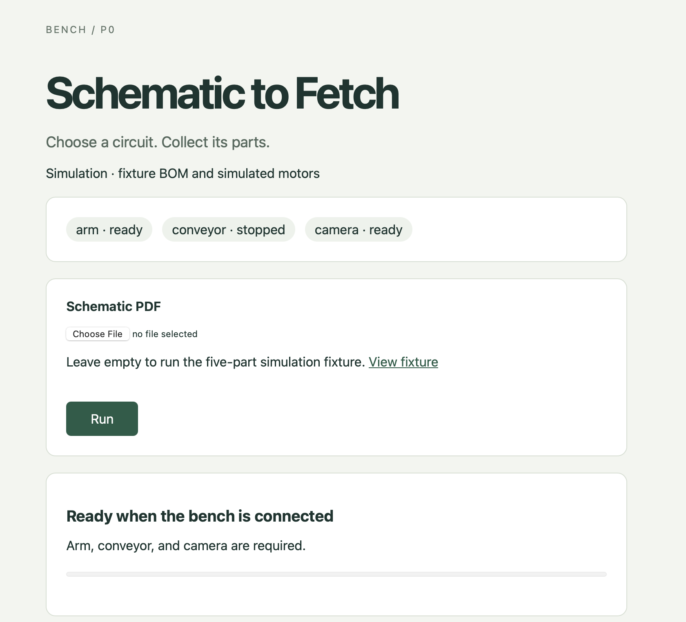

# Schematic to Fetch

## Camera-free SO-100-DUPE / SG90 pick-and-place

This module consumes an existing BOM and picks from fixed palette slots using **commanded target angles only**. SG90 PWM hobby servos have **no position feedback**: there is no encoder capture, sensed arrival, grip confirmation, camera, IK, or ingestion in this path.

The explicit hardware layout is **six arm axes on PCA9685 channels 0–5, plus a separate gripper on channel 6** (seven outputs total). The sample names the sixth axis `joint_6` rather than guessing its mechanics. Rename logical axes in the config and all palette/startup/home maps together if needed. The Flask backend offers local camera-free simulation and a separate **HCP TCP palette-arm mode**, with simulation by default and explicit local arming for physical hardware. The original HCP/PDF/camera/Arduino workflow remains available separately below; ingestion code, legacy node definitions and the envelope/schema contracts are preserved.

### Quick start: no hardware

From the repository root, with Python 3.10+ (tested here on 3.13):

```sh
python3 -m venv .venv
source .venv/bin/activate
pip install -r requirements-palette.txt
python -m main run --bom sample_bom.json --dry-run
```

This prints the full ordered plan and **every interpolated step**, target-angle estimate, requested delay, settle interval, home and PWM-off action. It simulates five picks: A twice, B twice, C once. Simulated delays are logged without wall-clock waiting. Dry-run opens no I2C/network connection and does not import hardware, vision or ingestion libraries.

### Integrated backend / UI: no hardware required

```sh
pip install -r requirements-backend.txt
python -m ui.app --camera-free --web-port 5002
```

Open <http://127.0.0.1:5002>. With no upload, **Run** renders the demo PDF, obtains the fixture BOM, resolves palette slots and executes five simulated pick/place cycles. This mode uses a **fixed fixture BOM** even for uploaded PDFs; it does not infer their contents. Alternatively, paste an existing BOM in the form to bypass ingestion entirely. The UI shows the BOM, ordered angle plan, simulated placements, commanded-angle estimates, slew-step count, and the last 80 motion events.

For real PDF extraction using the already configured Baseten environment:

```sh
# BASETEN_API_KEY and BASETEN_VISION_MODEL must already be set in this terminal.
python -m ui.app --camera-free --live-ingestion --web-port 5002
```

Upload your actual schematic. The **existing ingestion pipeline** calls Baseten; downstream planning is deterministic and every arm move still uses SimDriver. No tool-calling model is needed, no HCP server/nodes are started, and no camera, conveyor, serial or I2C packages are imported. Live-ingestion mode requires an uploaded PDF or pasted BOM; it does not silently run the demo PDF. API credentials remain in the environment. Live calls can incur provider charges; offline fixture/BOM tests need no key.

`--palette PATH` selects a slot map and `--arm-config PATH` optionally supplies angle/slew limits. Even a config with `hardware_confirmed: true` **cannot enable physical motors in `--camera-free` mode**. Dummy, uncalibrated palettes are allowed because execution is simulated. Physical hardware is available through the operator-confirmed CLI or the explicitly enabled HCP mode below. `--camera-free`, `--palette-hcp` and the legacy `--simulate` mode are mutually exclusive.

The shared HTTP lifecycle is unchanged: submit → receive `202 {id,state}` → poll `GET /api/runs/<id>`. Camera-free mode also accepts a BOM directly:

```sh
curl -X POST http://127.0.0.1:5002/api/runs \
  -H 'Content-Type: application/json' \
  -d '{"bom":{"components":[{"component_id":"resistor:10k","qty":1}]}}'
```

`POST /api/runs` also accepts multipart `pdf`. `GET /api/status` reports `backend: "palette"`, `hardware: "simulated"`, the ingestion mode, and readiness without hardware nodes. Requests are serialized (concurrent submissions get 409); malformed PDFs/BOMs, missing slots and invalid targets fail visibly without partial picking. The web simulation is limited to 200 picks per run and 16 MiB per request. Completed placements are **software simulation results**, never physical delivery confirmations. Run records are in memory and do not survive restart; uploaded PDFs remain in the ignored instance directory. The Flask service is for local/trusted use, not an authenticated public deployment.

### HCP TCP integration: simulation first, then hardware

The backend and arm node communicate over the **existing generated HCP client**, discovery registry, newline-delimited JSON framing, and matching `ack`/`done` lifecycle. No new socket layer or broker is introduced. The dedicated node ID is `palette_arm`; the legacy camera-based `arm` node is unchanged.

```sh
# Terminal 1: Flask plus HCP host (both loopback by default).
pip install -r requirements-backend.txt
python -m ui.app --palette-hcp --hcp-port 9000 --web-port 5002

# Terminal 2, same environment: simulated arm node; no I2C access.
python -m arm.hcp_node --host 127.0.0.1 --port 9000
```

Open <http://127.0.0.1:5002> and paste a BOM or use the demo. The UI waits for `palette_arm`, then executes all five sample picks over **real local TCP with simulated motors**. Append `--live-ingestion` to the backend command for actual Baseten PDF extraction. No camera/conveyor nodes are needed. The node generates/imports `out/palette_arm_hcp_support.py` itself; running that generated file alone does not attach motion handlers.

For physical operation, first complete wiring review, config confirmation and palette tuning below. Both processes must load the same tuned palette; the node's hardware config is authoritative. On the Pi, install both `requirements-backend.txt` and `requirements-so100.txt`, then:

```sh
# Terminal 1: allow (but do not arm) a physical node. JSON BOM needs no API key.
python -m ui.app --palette-hcp --allow-hardware \
  --palette palette.local.yaml --arm-config config/so100.json --web-port 5002

# Terminal 2, Pi: the only process that owns the PCA9685.
python -m arm.hcp_node --hardware --host 127.0.0.1 --port 9000 \
  --palette palette.local.yaml --config config/so100.json
```

At the Pi terminal, type `ARM`, review the startup-angle assumption, then type `START` only after establishing that safe physical pose. Submit the reviewed BOM within 30 seconds or the unused arming expires. Network requests **cannot arm** the node. Each completed run homes, disables PWM, closes the bus, and requires fresh local confirmation for another run. Physical mode refuses fixture PDF ingestion; use a reviewed JSON BOM or explicitly enable live ingestion.

For separate machines, set the backend's `--hcp-bind` to its confirmed LAN interface and the node's `--host` to that same address. Do not guess the Pi IP or expose TCP/Flask to the public internet: this demo has **no authentication/TLS**. Only one backend/driver process should control the arm, and only the intended node should be on the trusted network. Config `hardware_confirmed`, a calibrated palette, backend `--allow-hardware`, node `--hardware`, and local startup confirmation are all required.

During a run, a heartbeat keeps a five-second node-side lease alive while the independent motion worker runs. A missing heartbeat, TCP disconnect, emergency abort, or node shutdown cancels the active ramp and **attempts immediate PWM disable, without recovery homing**. This differs intentionally from ordinary standalone CLI cleanup: losing control of a network session must not start another trajectory. Reconnection never resumes a run or re-arms physical hardware. Keep the arm supported; disabling PWM may release it. A process crash, hung I2C bus or failed disable still needs a physical cutoff.

See [JSON formats and complete HCP command lifecycle](docs/palette-hcp.md) for the HTTP BOM, wire envelopes, session commands, and failure semantics. `done` means the commanded ramp and settle finished—not sensed arrival or successful grip. The UI marks physical placements **unverified**.

### Wiring: PCA9685, not a serial servo bus

Connect Pi SDA/SCL to PCA9685 SDA/SCL, Pi **3.3 V logic** to VCC, and Pi ground to GND. Connect a **separate regulated 5–6 V servo supply**, appropriate for your actual SG90 variant, to the servo V+ rail and ground. Join servo supply ground, PCA9685 ground and Pi ground. Never power the servos from the logic regulator or Pi's USB/5 V rail. Check polarity, connector pinout, adequate current capacity and supply stability before enabling motion. See Adafruit's [PCA9685 pinout and power separation](https://learn.adafruit.com/16-channel-pwm-servo-driver/pinouts).

Connect six arm servo signals to channels 0–5 and the gripper signal to 6; servo power/ground go to their corresponding rails. Enable I2C on the Pi. Confirm the actual bus/address; sample values are bus 1 and address 0x40 (decimal 64). Only one process may own this board. All channels share the PWM frequency, so do not share the board with loads requiring a different frequency.

Keep a physical servo-power cutoff within reach. PCA9685 OE can provide a separately engineered hardware output-disable path; this implementation does not control an OE GPIO. **The board keeps generating PWM if Python hangs or dies.** Software cleanup cannot replace a physical stop.

### Review config and pulse calibration

```sh
# On the Pi, for real hardware:
pip install -r requirements-so100.txt
cp config/so100.example.json config/so100.json
```

Settings live in `config/so100.py`, not root `config.py`, to preserve the repo's existing `config/` package. The local JSON file is git-ignored. Review before setting `hardware_confirmed: true`:

| Setting | Meaning |
| --- | --- |
| `i2c_bus`, `i2c_address` | Actual Linux bus and decimal 7-bit device address |
| `pwm_frequency_hz` | 50 Hz for this SG90 implementation |
| `reference_clock_hz` | Internal oscillator estimate; default 25 MHz, calibrate if pulse accuracy requires it |
| `channels.<joint>.channel` | Unique PCA9685 output 0–15; sample uses 0–6 |
| `min_pulse_us`, `max_pulse_us` | Pulse calibration endpoints for **0° and 180°**, not mechanical limit endpoints |
| `min_angle`, `max_angle` | Safe logical command range, within 0–180° |
| `invert` | Map the pulse using `180 - angle` |
| `max_step_deg`, `settle_ms` | Per-joint maximum commanded increment and positive settling time |
| `move_step_deg`, `step_delay_ms` | Global increment cap and delay after every ramp frame; delay must be ≥20 ms |
| `home_pose`, `gripper_open_deg`, `gripper_closed_deg` | Fallback targets; a loaded palette supplies the run's home/jaw targets |
| `startup_angles` | All seven assumed physical starting angles, explicitly confirmed for each session |

The sample uses conservative **1000–2000 µs** endpoints, 1° maximum increments, and 40 ms between frames. They are illustrative, not measured for your arm. SG90 variants may support ranges near 500–2400 µs, but do not adopt those extremes without checking your unit. Start near the centre with the linkage unloaded/supported, extend pulse endpoints incrementally, observe travel, and stop before buzzing, binding or hard stops. Set joint limits inside safe mechanical travel. Never force the gears to “capture” a position.

Pulse mapping is linear over logical 0–180°, with optional inversion; tightening `min_angle/max_angle` does **not** stretch the pulse range. After changing pulse endpoints, inversion, horn mounting, channel assignment or mechanics, retune the palette. The driver accounts for prescaler rounding and staggers PWM phases using the [PCA9685 register specification](https://www.nxp.com/docs/en/data-sheet/PCA9685.pdf). It uses [smbus2](https://smbus2.readthedocs.io/en/latest/); the small `PWMBackend` interface also allows an Adafruit implementation without changing the planner/executor.

### Startup: an unavoidable open-loop limitation

The first pulse cannot be slew-limited relative to an **unknown physical pose**. `startup_angles` is an operator-supplied assumption, not a measurement or automatic last-session restore. Every real command prints it and requires typing `START` **before opening I2C**. Establish a known, supported pose through your safe assembly/startup fixture procedure; do not force SG90 gears by hand. If the pose is unknown, do not confirm. First energization can jump if the assumption is wrong.

After that first assumed frame, the driver ramps from its last successfully sent targets. Slippage, stalls, gravity sag and missed physical movement remain invisible. `relax()` ends the session; further moves require a new driver and startup confirmation.

### Calibrate by TUNING, not capture

Edit slot IDs, labels and component lists in `palette.yaml` or a custom template, then:

```sh
python -m main calibrate --config config/so100.json --palette palette.local.yaml --template palette.yaml
```

For **each joint of each waypoint**, the CLI shows its current **commanded** angle. Enter:

- `+` / `-`: nudge 1°.
- `+N` / `-N`: move relatively by N degrees.
- `=N`: set an absolute target angle.
- `save`: accept this joint and advance.
- `quit` / Ctrl-C: cancel, attempt home, then relax.

Every jog—including jaw tuning—uses the same slew, angle limits and settle delays as execution. Out-of-limit/nonfinite input is loudly rejected without moving. The flow tunes home, place approach/drop, each slot's approach/grasp, then gripper open/closed at the newly tuned home. It starts each pose from current commanded targets: **it never automatically replays dummy template waypoints**. Watch all intervening motion for clearance.

Finally type `SAVE` to atomically write the complete palette. Cancelling before that preserves the previous file. If the output file already exists, it supplies the slot identities for retuning. Until a new home is accepted, cleanup uses the confirmed startup pose as its recovery target; afterward it uses the newly tuned home. Calibration exits with home → relax, not powered holding. Support the arm against gravity.

The sample is `calibrated: false` and blocked from real run/home. Successful tuning writes `calibrated: true`; this is an operator-tuning flag, **not evidence of measured positions or grip reliability**. Use ignored `palette.local.yaml` for real settings; omitting `--palette` overwrites the root sample.

### Palette and BOM contracts

`palette.py` strictly validates this shape:

| Field | Shape |
| --- | --- |
| `home` | All six arm joint names → finite target degrees |
| `gripper` | `open_deg`, `closed_deg` → distinct target angles |
| `place_target` | `approach`, `drop` → six-joint target maps |
| `slots` | Nonempty list of `{id, label, components, approach, grasp}` |
| `components` | Nonempty component-ID strings; each ID maps to exactly one slot |
| `calibrated` | Optional boolean, defaults false |

The gripper must not appear in arm waypoints: lift/home must preserve the current jaw command. Duplicate IDs/YAML keys, missing/extra joints, malformed numbers, and out-of-limit angles fail validation. `lookup(component_id)` raises `MissingComponent`; `validate_all_angles_within_limits()` uses the palette's configured limits.

The sample BOM is `{"components":[{"component_id":"resistor:10k","qty":2}]}`. Existing ingestion output works unchanged: a line with `type: "resistor"`, `value: "10k"`, `quantity: 2` resolves to the exact ID `resistor:10k`. Positive integer quantities expand in input order. All unresolved lines are reported and **the entire run is rejected before hardware opens**. No part is silently skipped.

### Run the tuned palette

```sh
# Inspect the real targets without hardware:
python -m main run --bom sample_bom.json --palette palette.local.yaml --config config/so100.json --dry-run
# Supervised execution; requires START confirmation:
python -m main run --bom sample_bom.json --palette palette.local.yaml --config config/so100.json
# Home, then disable PWM:
python -m main home --palette palette.local.yaml --config config/so100.json
```

Each pick: home → open jaws → slot approach → grasp → verification hook → close/settle → lift to approach → place approach → drop → open/settle → home. Every frame writes all seven outputs; each axis advances at most `min(move_step_deg, channel.max_step_deg)`. The driver waits the configured step delay and then the maximum settle time of the targeted joints. This limits **commanded** motion, not measured physical velocity.

Standalone CLI success, exceptions, Ctrl-C and SIGTERM attempt home → relax → close. Relax explicitly sets every owned output full-off even if one channel fails. Home is refused after an I2C write failure makes the commanded state uncertain; cleanup still attempts to disable all outputs and reports the failure. Bus/power failure, SIGKILL or a machine crash cannot guarantee a stop. Removing PWM does not disconnect servo supply and may release holding force.

There is no collision planning, stall timeout based on motion feedback, stock sensing, or verified grasp. `grasp_verify()` is a no-op before closure; a future external sensor can raise/return false to reject the pick. Check all paths, including drop→home and recovery from intermediate poses. Begin with empty jaws. Tune a gentle closed target: the software cannot detect an SG90 straining against a hard stop.

Repeated quantities revisit the **same grasp pose**. A feeder/operator must present another component there after each pick; a scattered tray is not a repeatable feeder. Keep the arm/palette/tray fixed and verify the delivered parts manually.

### Driver seam and verification

`ArmDriver` exposes `move_to(waypoint, blocking=True)`, `set_gripper`, `home`, `relax`, and a copy of `commanded_angles`. **There is no `read_positions()`.** Blocking means commanded ramp + timed settling, never sensed arrival. Nonblocking moves return a Future; overlapping moves fail and relax cancels/waits for the active ramp before disabling outputs. The optional `tune_gripper(angle_deg)` extension supports calibration. A future smart-servo adapter can implement the same interface without planner/executor changes.

The previous Feetech driver/encoder-capture calibration and their tests have been replaced, not selected as an alternate SG90 mode. Old encoder palettes/configs are incompatible and fail validation. No serial servo SDK is required.

```sh
pip install pytest
python -m pytest -q tests/test_palette_pick_place.py tests/test_pca9685_driver.py
```

Tests cover BOM mapping, full dry-run import isolation, all-channel slew frames, configured delays, jaw preservation, pulse mapping/inversion, PWM registers, I2C failures, async cancellation, recovery/relax, and live-tuning save/cancel behavior with fake hardware. Real grip reliability, power stability and collision clearance still require supervised hardware testing.

## Legacy PDF / AprilTag / Arduino demo

The remaining instructions describe the original camera-based hardware path, not the SO-100 CLI above.

Upload a PDF, let the vision model produce a validated bill of materials, and the Pi coordinates an AprilTag camera, a four-degree-of-freedom arm, and a timed conveyor to collect the mapped components.



One Flask button starts PDF → BOM → arm pick/place → belt delivery. Python runs on the Pi; Arduino firmware owns PWM. Every HCP node is a TCP client. Host, orchestrator, ingestion, and UI share one process. Arm and conveyor share one serial connection while registering as separate nodes.

The five-part simulation verifies software behavior. Physical delivery and live Baseten accuracy require event hardware, models, calibration, and a hand-checked schematic. Timed servo completion does not measure whether a part was gripped.

## Architecture

```text
       HCP SCHEMATIC-TO-FETCH

    ┌──────────────────┐
    │ PDF Schematic    │
    └────────┬─────────┘
             ↓
    ┌──────────────────┐
    │ Ingestion        │
    │ Pipeline         │
    │                  │
    │ PDF → Images     │
    │ Vision / OCR     │
    │ Symbol Detection │
    └────────┬─────────┘
             ↓
    ┌──────────────────┐
    │ Structured BOM   │
    │                  │
    │ R1 → 10kΩ        │
    │ C1 → 100µF       │
    │ U1 → NE555       │
    └────────┬─────────┘
             ↓
    ╔══════════════════╗
    ║       HCP        ║
    ║ Hardware Context ║
    ║     Protocol     ║
    ╚════════╤═════════╝
             ↓
    ┌──────────────────┐
    │       LLM        │
    │                  │
    │ "Fetch R1"       │
    └────────┬─────────┘
             ↓
    ┌──────────────────┐
    │ Camera + OpenCV  │
    │ + AprilTags      │
    └────────┬─────────┘
             ↓
      X,Y coordinates
             ↓
    ┌──────────────────┐
    │  Raspberry Pi 5  │
    │        ↓         │
    │   Servo Control  │
    └────────┬─────────┘
             ↓
             🦾
           SO-100
             ↓
      PICK COMPONENT
```

## Run the simulation

Use Python 3.11+ (verified on Python 3.13). OpenCV contrib includes AprilTag detection; do not also install a conflicting opencv-python package.

```sh
python3 -m venv .venv
source .venv/bin/activate
pip install -r requirements.txt
python -m ui.app --simulate
```

Open <http://127.0.0.1:5000> and click **Run** without uploading a PDF. The fixture requests two 10k resistors, two 0.1uF capacitors, and one NE555. It uses real PDF rendering, OpenCV detection of a generated saved tag image, generated clients, TCP framing/discovery, orchestration guards, IK, and command lifecycle handling. Model responses and motors are fixtures. Uploaded PDFs in simulation also use the fixture BOM; the UI explicitly labels simulation.

Demo assets live in ignored `instance/simulation/`. Simulation never opens an Arduino, real camera, or Baseten connection.

To exercise the real PDF→BOM call while retaining simulated arm/conveyor behavior, export the Baseten key and start the hybrid backend:

```sh
export BASETEN_API_KEY='<your-key>'
export BASETEN_VISION_MODEL='moonshotai/Kimi-K2.6'
python -m ui.app --simulate --live-ingestion --web-port 5001
```

Upload a PDF at <http://127.0.0.1:5001>. Baseten supplies the BOM; only the downstream hardware actions are simulated. The key is read from the process environment and is never written to the repository.

## Event configuration

Copy `config/hardware.example.json` to ignored `config/hardware.json` and fill every null / `<CONFIRM>`. Unfilled templates cannot enable motion. `.env.example` documents variables; `.env` is not auto-loaded. Keep API keys in the environment, never in committed files.

```sh
export BASETEN_API_KEY='<CONFIRM>'
# Recommended current vision/tool-capable slug; verify availability in your catalog.
export BASETEN_VISION_MODEL='moonshotai/Kimi-K2.6'
export BASETEN_TOOL_MODEL='moonshotai/Kimi-K2.6'
export HCP_HOST='<CONFIRM_PI_IP>'
export HCP_PORT=9000
export HARDWARE_CONFIG=config/hardware.json
```

The default recommendation is `moonshotai/Kimi-K2.6`, which Baseten currently lists as vision-capable and which supports structured outputs and tool calling through the OpenAI-compatible endpoint. Requests use `https://inference.baseten.co/v1`, bounded 429 backoff, and local output validation. Rate limits are account-level, so run tests sequentially rather than in parallel; Baseten's default Basic-unverified limit is 15 requests/minute. Verify the slug and effective limits in your Baseten catalog before spending credits. Unsupported features do not silently fall back to unstructured output. Voice/STT is P1 and has no P0 dependency.

| Area | Values to measure or confirm |
| --- | --- |
| Serial | Arduino USB port and matching firmware baud |
| Arm | Two link lengths; shoulder-origin world position; base yaw; elbow branch (`-1` or `1`); servo zeros, signs, limits; home pose; gripper positions; movement and settling times |
| Bins | Tag-local XY grasp offset and world Z pickup height for every tag |
| Zones | Actual `belt`/staging XYZ coordinates and a reachable clearance height |
| Belt | Neutral/forward pulse widths, measured delivery duration, maximum duration |
| Camera | Source, calibration resolution, pixel-to-bench homography, publication rate and maximum pose age |

World XY lies on the bench and Z points upward. Distances are meters, tag heading is radians, and joint commands are degrees. `base_world_m` is the shoulder origin. The arm model has base yaw, shoulder/elbow pitch, and gripper, with no wrist. Validate approach/retreat paths and natural grasp orientation on the real bench.

For calibration, record at least four non-collinear correspondences in JSON with `image_size`, `pixel_points`, and `world_points_m`, then run:

```sh
python -m vision.calibrate --points '<CONFIRM_CALIBRATION_POINTS_JSON>'
```

Copy its printed homography and image size into camera config. Capture resolution must match calibration. The planar transform assumes the detection plane matches calibration; account for lens distortion and tag height when measuring pickup accuracy.

Inventory tags identify repeatable pickup bins. Each exact `(type, value)` has one unique tag; quantity two means two picks from that bin. Bins must expose one graspable part at the same calibrated location after each pick and contain enough stock. Missing mappings produce warnings; available parts are delivered and the run finishes `incomplete`. There is no stock/depletion sensing.

## Firmware and real hardware

Copy `firmware/pins.example.h` to ignored `firmware/pins.h`; fill the confirmed baud and five servo pins. No physical defaults are supplied. With arduino-cli, the Servo library, and the confirmed board core installed:

```sh
python scripts/build_firmware.py --fqbn '<CONFIRM_BOARD_FQBN>'
```

This stages Arduino's required matching sketch directory and compiles without uploading. Upload with the Arduino IDE or your board's confirmed-port workflow. Native C++ harness tests do not replace compiling for the actual board.

The belt protocol assumes a continuous-rotation servo/drive accepting neutral/forward PWM; confirm the installed drive supports this. A standard positional servo does not provide unlimited timed travel. Position-indexed mechanics require a coordinated conveyor contract change.

Firmware boots without attaching arm servos. The first joint command establishes the initial pose; perform the first home under supervision. It interpolates joints, waits for configured settling, stops the belt before completion, and monitors a 250 ms heartbeat with a 1.5 s timeout. Loss of communication stops the belt and holds current arm targets. Interrupted actuator sessions latch a fault and require inspection/restart.

First test the standalone host with generated stub nodes:

```sh
python -m hcp_host.server --port 9000
python hcp_sdk/hcp_sdk_gen.py --input hcp_sdk/nodes/arm.json --output ./out --host "$HCP_HOST" --port "$HCP_PORT"
python hcp_sdk/hcp_sdk_gen.py --input hcp_sdk/nodes/conveyor.json --output ./out --host "$HCP_HOST" --port "$HCP_PORT"
python hcp_sdk/hcp_sdk_gen.py --input hcp_sdk/nodes/camera.json --output ./out --host "$HCP_HOST" --port "$HCP_PORT"
PYTHONPATH=. python out/arm_hcp_support.py
```

Generated clients discover themselves but report errors until handlers are attached. They never pretend to move hardware. Stop the standalone host before starting the integrated app; both own the HCP port.

For real operation, run these in separate Pi terminals:

```sh
# Owns host, orchestration worker, ingestion, and UI.
python -m ui.app
# Owns the only Arduino connection and registers BOTH actuator nodes.
python -m actuator.arm_node --host "$HCP_HOST" --port "$HCP_PORT"
# Camera node; optionally use --image PATH for a saved calibrated image.
python -m vision.camera_node --host "$HCP_HOST" --port "$HCP_PORT"
```

Runtime launchers regenerate/import `out/<id>_hcp_support.py`. Run from the repo root in its Python environment. HTTP defaults to loopback; pass `--web-bind 0.0.0.0` to access the UI over the event LAN. HCP listens on the LAN. These services have no internet-facing authentication and are intended for the trusted demo network.

Upload a schematic and press Run. Runs are serialized. Tools first stop the belt and home the empty arm, then perform pick → place-and-retreat → advance-and-stop for each unit. The ledger counts delivery only after conveyor completion. Empty the output tray before a new complete run.

## Interfaces and failure behavior

The four frozen contracts are the unchanged upstream node schema, NDJSON envelope, supplied BOM schema, and `bench_inventory.json` shape. See [protocol details](docs/protocol.md).

```json
{"action":"pick","id":"c17","device_id":"arm","payload":{"tag_id":3}}
```

All TCP messages are UTF-8 JSON plus newline, bounded to 1 MiB. Discovery replies echo `REQUEST_HCP_DATA` and its ID, identify the node, and carry its full definition in `payload`. Camera publications are latest snapshots, including empty detections. Socket reads, queued writes, and handlers run independently.

Only `done` resolves a command. Reconnection rediscovers nodes and never replays physical commands. The orchestrator checks schema, requested tags/quantities, fresh poses, arm/belt sequencing, and delivery duration before dispatch. Model call validation permits bounded correction; hardware errors terminate the run. No grip-failure replanning or measured grip feedback is implemented.

HTTP: `POST /api/runs` accepts multipart `pdf` and returns `202 {id,state}`; `GET /api/runs/<id>` reports progress/warnings/deliveries; `GET /api/status` reports nodes and health. Concurrent submissions return 409. Uploads are capped at 16 MiB/eight PDF pages. Run records are in memory and do not resume after restart.

## Verification

```sh
python -m pytest -q
python -m ingestion.parse --pdf '<CONFIRM_DEMO_PDF>' --expected '<CONFIRM_GROUND_TRUTH_JSON>'
```

Tests cover framing and UTF-8 fragmentation, discovery/late nodes, correlation, timeout/reconnect, concurrent context, registry tools, repeated bin quantities, missing parts, rejected actions, IK, saved-image tags, PDF/model constraints, 429 retry limits, serial correlation, firmware timers/watchdog, and a Flask-triggered five-part simulation. Firmware harness tests require a C++ compiler.

At the event, compare the extracted BOM to hand-checked ground truth, measure `advance(2.0)`, verify calibration, then complete at least five consecutive physical picks with no failed grip. Manually compare tray contents to the schematic. Simulation success is separate from physical acceptance.

Voice, missing-part UI polish, grip replanning, Snowflake, and fine-tuned readers remain P1/P2.

## Reference provenance

Reference: [danielzyy/calhacks2025](https://github.com/danielzyy/calhacks2025/tree/f7cf00663244377b9c79270f0175756904819534), pinned at `f7cf00663244377b9c79270f0175756904819534`.

- Generator: retains upstream validation, CLI and output naming; the generated connect/listen/events/response-queue template is extracted into `hcp_sdk/runtime.py` and extended with framing, IDs, independent workers and backoff.
- Node schema: copied unchanged.
- Host: adapts `hcp_client/main.py` and `hcp_executor.py` accept/read/queue and registry-dispatch code.
- Camera: adapts `vision/tag_detections.py` OpenCV AprilTag setup; upstream hardcoded geometry/calibration is not used.

Baseten calls follow its [Chat Completions API](https://docs.baseten.co/reference/inference-api/chat-completions). No ASI1, LeRobot motor layer, microphone stack, or broker is included.
